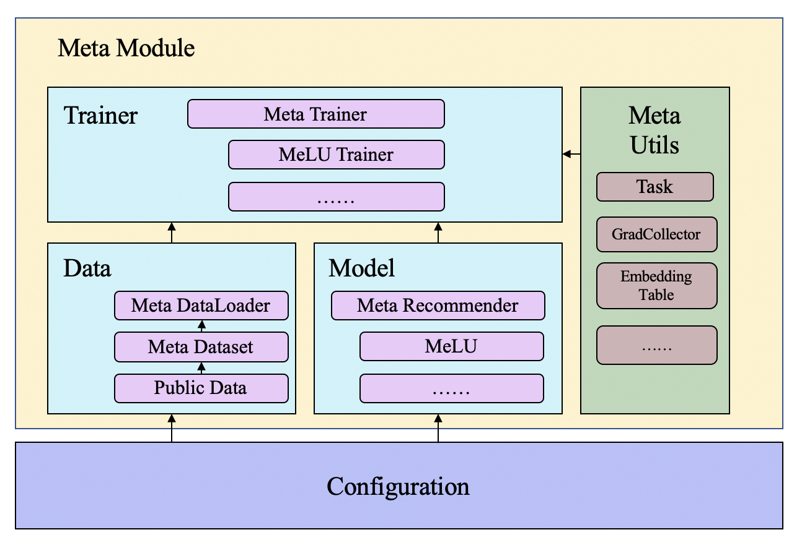

## RecBole-MetaRec


**RecBole-MetaRec** is an extended module for [RecBole](https://recbole.io), which aims to help researches to compare and develop their own models in meta learning recommendation field.

This module is totally developed based on RecBole by adding extened classes and functions, without modifying any codes of RecBole core. In addition, we built up extented modules with [Pytorch](https://pytorch.org). 

This module can mainly provide researchers the following advantages:

- **Conveniently develop** their own meta learning recommendation models.
- **Conveniently learn and compare** meta learning recommendation models that we have implemented.
- **Enjoy advantages and features of RecBole.**

Moreover, we provide a document in detail for researchers.

**Document: https://recbole-metarec-doc.readthedocs.io/en/latest/**

**Note:** Before starting, it is strongly recommended to realize how RecBole works.



### Contributions

The contributions are briefly listed as follows:

- We extend `MetaDataset` from `Dataset` to split dataset by 'task'.
- We extend `MetaDataLoader` from `AbstractDataLoader` to transform dataset into task form.
- We extend `MetaRecommender` from `AbstractRecommender` to provide a base recommender for implementing meta learning model.
- We extend `MetaTrainer` from `Trainer` to provide a base trainer for implementing meta learning training process.
- We extend `MetaCollector` from `Collector ` to collect data for evaluation in meta learning circumstance.
- We implement `MetaUtils` with some useful toolkits for meta learning.
- We implement most of the models in the field of meta learning recommendation for user cold start and conduct envaluations in unified settings.

### Requirements

```
python>=3.7.0
recbole>=1.0.1
numpy>=1.20.3
torch>=1.11.0
tqdm>=4.62.3
```

### Quick-Start

After the package installation process, you can run the demo code with:

```
python run.py
```

Also, you can also change the model by modifying `modelName` in `run.py`.

### Implemented Models

We list the models that we have implemented up to now:

- [MeLU](model/FOMeLU/FOMeLU.py) from Hoyeop Lee *et al.*: [MeLU: Meta-Learned User Preference Estimator for Cold-Start Recommendation](https://dl.acm.org/doi/abs/10.1145/3292500.3330859) (SIGKDD 2019). **Note: We implement both MeLU with FOMAML and Full MAML, but we conduct the evaluation with MeLU in FOMAML method.**
- [MAMO](model/MAMO/MAMO.py) from Manqing Dong *et al.*: [MAMO: Memory-Augmented Meta-Optimization for Cold-start Recommendation](https://dl.acm.org/doi/abs/10.1145/3394486.3403113) (SIGKDD 2020).
- [TaNP](model/TaNP/TaNP.py) from Xixun Lin *et al.*: [Task-adaptive Neural Process for User Cold-Start Recommendation](https://dl.acm.org/doi/abs/10.1145/3442381.3449908) (WWW 2021).
- [LWA](model/LWA/LWA.py) from Manasi Vartak *et al.*: [A Meta-Learning Perspective on Cold-Start Recommendations for Items](https://proceedings.neurips.cc/paper/2017/hash/51e6d6e679953c6311757004d8cbbba9-Abstract.html) (NIPS 2017).
- [NLBA](model/NLBA/NLBA/py) from Manasi Vartak *et al.*: [A Meta-Learning Perspective on Cold-Start Recommendations for Items](https://proceedings.neurips.cc/paper/2017/hash/51e6d6e679953c6311757004d8cbbba9-Abstract.html) (NIPS 2017).
- [MetaEmb](model/MetaEmb/MetaEmb.py) from Feiyang Pan *et al.*: [Warm Up Cold-start Advertisements: Improving CTR Predictions via Learning to Learn ID Embeddings](https://dl.acm.org/doi/abs/10.1145/3331184.3331268) (SIGIR 2019).
- [MWUF](model/MWUF/MWUF.py) from Yongchun Zhu *et al.*: [Learning to Warm Up Cold Item Embeddings for Cold-start Recommendation with Meta Scaling and Shifting Networks](https://dl.acm.org/doi/abs/10.1145/3404835.3462843) (SIGIR 2021).

### Results

We tune hyper-parameters of all the models that we have implemented and obtain the performance board respectively.

- Evaluation on [MovieLens-100K](asset/result/MovieLens-100K.md) dataset
- Evaluation on [MovieLens-1M](asset/result/MovieLens-1M.md) dataset
- Evaluation on [BookCrossing](asset/result/Book-Crossing.md) dataset

### Developer

RecBole-MetaRec is mainly developed by Zeyu Zhang ([@nuster1128](https://github.com/nuster1128)).

### Acknowledgegment

The implementation is based on the open-source recommendation library [RecBole](https://github.com/RUCAIBox/RecBole).

Please cite the following paper as the reference if you use our code or processed datasets.

```
@inproceedings{zhao2021recbole,
  title={Recbole: Towards a unified, comprehensive and efficient framework for recommendation algorithms},
  author={Wayne Xin Zhao and Shanlei Mu and Yupeng Hou and Zihan Lin and Kaiyuan Li and Yushuo Chen and Yujie Lu and Hui Wang and Changxin Tian and Xingyu Pan and Yingqian Min and Zhichao Feng and Xinyan Fan and Xu Chen and Pengfei Wang and Wendi Ji and Yaliang Li and Xiaoling Wang and Ji-Rong Wen},
  booktitle={{CIKM}},
  year={2021}
}
```
